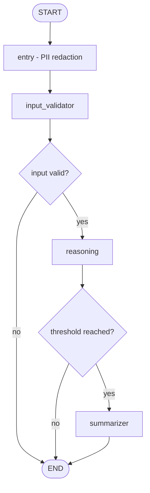

# Simple Multimodal Voice Agent

This project contains **two independent agent implementations** that share configuration, speech services, and LLM routing:

1. **A LangGraph multimodal agent** (`src/flow_agent/`) served as an API and driven by a Streamlit web UI in `ui/`. Accepts text and image input, transcribes optional audio, and runs a security + reasoning + summarization pipeline.
2. **A LiveKit real-time voice agent** (`src/livekit_*.py`). Speech-in / speech-out with tool calling, interruption handling, and long-conversation context management.

Both draw on the same **weighted multi-provider LLM layer**, the same **speech service** package, and the same **Pydantic settings**.

## The LangGraph pipeline

- `entry` normalizes the message and optionally redacts PII.
- `input_validator` scans for malicious patterns and calls the OpenAI moderation API.
- `reasoning` calls the selected LLM with multimodal content.
- `summarizer` compresses history once the message count crosses a threshold.

See [Architecture](/architecture) for the exact nodes, edges, and state.

## Technology map

| Area | Technology | Where |
|---|---|---|
| Orchestration | LangGraph | `src/flow_agent/graph.py` |
| Model interface | LangChain | `src/flow_agent/llms/LangChainChatLLM.py` |
| Resilience | aiobreaker + Tenacity | `src/flow_agent/utils/circuit_breaker_llm.py` |
| Configuration | pydantic-settings | `src/flow_agent/configurations/config.py` |
| Safety | custom patterns + OpenAI moderation + Presidio | `src/flow_agent/utils/` |
| Speech | SarvamAI, OpenAI, Google GenAI | `src/flow_agent/speech/` |
| Real-time voice | LiveKit Agents | `src/livekit_*.py` |
| Web UI | Streamlit | `ui/` |
| Observability | LangSmith, Arize, Phoenix | `src/flow_agent/configurations/arize_config.py` |
| Testing | pytest | `tests/` |

## Where to go next

- [Installation](/installation) — install, configure, and run.
- [Quickstart](/quickstart) — bring up both agents.
- [Architecture](/architecture) — how the graph is wired.
- [Dependencies](/dependencies) — what is declared and what is missing.
